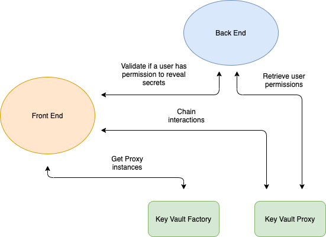

# Architecture



# How it works

## Shamir's secret sharing

The protocol is based on Shamir's secret sharing algorithm. The mechanism has one great benefit - An unauthorized user is not able to obtain the shared key and reveal a secret with it.

Once a shared key is generated, it is split with threshold of 2 between the contract and the owner of the contract. That being said, to be able to reconstruct again the shared key, the contract and the owner have to provide their shares. When a new user comes, he receive his own share of the shared key. That means, if the last one wants to reveal a secret he has to combine his share with at least one more share to pass the threshold. Only one share is not enough to reconstruct the shared key and to reveal a secret.

So what happens when a user has been unauthorized? He still has his share? 

- Yes, he has his share, however, he can do nothing with it as no body else will provide their share.

## Back End

A user needs one more share to reveal a secret. The purpose of the REST API is to provide a share only in the case the requesting user is an authorized one. 

## New Key Vault

To deploy a new Key Vault contract, one has to provide 3 values

- encrypted shared key - The shared key used to symmetrically encrypt secrets. It is encrypted asymmetrically with the owner's private key so if there is a need, he would be able to obtain it always
- encrypted owner share - Asymmetric encrypted owner share
- encrypted contract share - Asymmetric encrypted share used by the REST API

## Authorize a user

An authorized user decrypts his share by using his Ethereum private key and provides it to the REST API. The API retrieves the contract share and decrypt it by a preset private key. By passing the threshold of 2 shares, the shared key is being reconstructed. By having the shared key, a new share is being generated for the new user. The user asymmetrically encrypts his share so he will be the onliest one to decrypt it when needed.

## Unauthorize a user

An authorized user broadcast an '**unatuhorize**' transaction. By doing that he removes previously authorized user.

## Add a secret

An authorized user decrypts his share by using his Ethereum private key. The secret value and the user share are being provided to the REST API. The API retrieves the contract share and decrypt it by a preset private key. By passing the threshold of 2 shares, the shared key is being reconstructed. Once having the shared key, the API uses it to encrypt symmetrically the secret value. The requester broadcast the result to the blockchain.

## Reveal a secret

### Authorized user

An authorized user requests an authorization challenge. 

1. API generates a challenge(message) and encrypt it with the user public key
2. The user decrypts the message with his Ethereum private key
3. The user signs the message and send the signature to the API
4. The API recovers the provided signature to obtain the address of the signer
5. Once the signer address is obtained, the API checks if such one exists in the list of **authorized users** in the contract

If such an address exists the API retrieves the contract share and decrypt it by a preset private key. By passing the threshold of 2 shares, the shared key is being reconstructed. Once having the shared key, the API uses it to decrypt symmetrically the requested secret value. 

### Unauthorized user

If an unauthorized user bypass the front-end and request the API directly to reveal a secret by providing his share the authorization challenge will act as a guard. The signer address will be obtained but it won't be in the list of **authorized users** and the API won't provide the contract share to reveal the secret.

# Build & Start

## Prerequisites

- Metamask v8

## Front End

- In **web/src/config/configs.json** add the REST API public key

    To obtain one → run the front-end, select a wallet in Metamask and click on "**get public key"** button

```jsx
npm install
# Run a local node
npm run chain 
npm run start
```

## Back End

- Create .env file from the .env.example one. Add the private key of the Metamask wallet you retrieved the public key for from above

```jsx
npm install
npm run build
npm run watch
```

## Smart Contracts

```jsx
npm install
# Run a local node
npm run chain
# Compile the contracts
npm run compile
npm run test
```